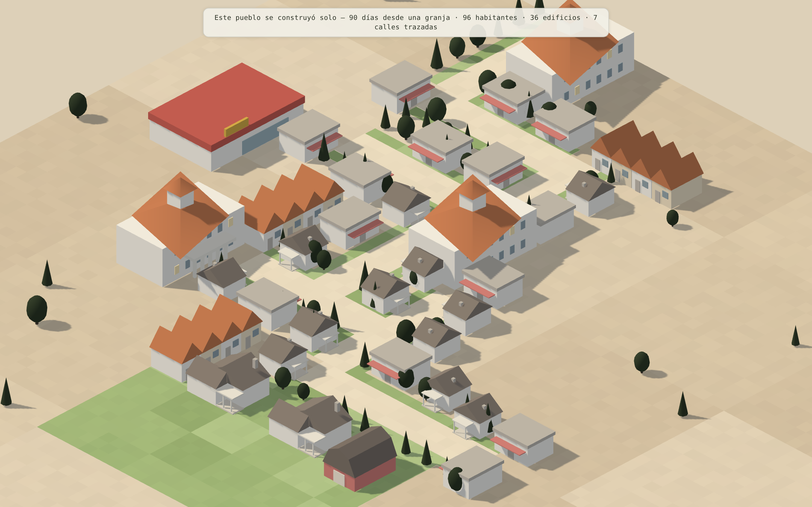

# city-bill

Un city-builder para navegador donde **la ciudad se construye sola** y sus
vecinos **viven vidas autónomas**. Estética low-poly isométrica pastel: flat
shading, sombras largas, cero texturas. Todo determinista a partir de una semilla.



> El pueblo de arriba no lo colocó nadie: emergió de **una sola granja** en 90 días
> de juego. La ciudad trazó sus propias calles, levantó casas, tiendas y un
> ayuntamiento, y se pobló de familias que trabajan, compran y envejecen.

## Ejecutar

```bash
npm install
npm run dev        # http://localhost:5173
npm test           # tests headless de la simulación (grid + sim, sin navegador)
npx tsc --noEmit   # type-check
```

## Modos (query params)

| URL | Qué muestra |
|---|---|
| `/` | Un pueblo sembrado con semilla que **vive y crece** en tiempo real. |
| `/?scene=farm` | **Modo autónomo puro**: desde una granja, la ciudad se construye sola. |
| `/?scene=grown` | **Vitrina**: corre 90 días al instante y enseña el pueblo resultante. |
| `/?scene=buildings` | Expositor del catálogo completo de edificios. |
| `/?seed=N` | Fuerza la semilla del mundo (comparte un pueblo, reproduce un bug). |

Controles: arrastrar/WASD para mover, rueda para zoom, **Q**/**E** para rotar,
clic en un vecino para inspeccionarlo, **F** para seguirlo, **C** para la crónica,
**0**–**3** para la velocidad del tiempo (también en la barra de control), **F3**
para el panel de rendimiento.

## Qué lo hace especial

- **Construcción autónoma (Fase 4).** La demanda sale del estado REAL de la sim
  (paro, viviendas llenas, tiendas saturadas), no de un guion. Cuando falta
  frente construible, la ciudad **traza sus propias calles** y crece en trama 2D
  tupida, con **mezcla de densidades** (casitas → adosados → paneláks → bloques
  Zlín) según su madurez. Cada edificio se **levanta con andamio y pop**, no
  aparece de golpe.
- **NPCs de verdad (Fase 3).** Ciudadanos con necesidades, personalidad y una
  IA de utilidad: el patrón día/noche (trabajar, comer, comprar, socializar,
  dormir) **EMERGE** de las curvas, sin horarios hardcodeados. Nacen, forman
  pareja, crían, enferman, envejecen y mueren; la Crónica recuerda a sus pilares.
- **Economía y sociedad vivas.** Empleos reales en edificios, salarios,
  impuestos, alquiler, pensiones, prestigio del hogar, epidemias con cuarentena
  y vacunación, inmigración por atractividad y emigración digna por penuria.
- **Determinismo total.** Todo el mundo se reconstruye desde una semilla; nada
  usa `Math.random()` en la lógica. Los tests corren días de juego en milisegundos.
- **Rendimiento de maqueta.** Instancing para toda la vegetación, mundo por
  chunks con frustum culling, simulación en un Web Worker desacoplada del render.

## Stack

- **Three.js** — render 3D real con cámara **ortográfica isométrica** (azimut 45°,
  elevación 32°): 3D de verdad (no sprites) para rotar la cámara y animar
  luz/estaciones, con proyección ortográfica para el look "de maqueta".
- **TypeScript + Vite** — DX rápida, build para navegador sin config.
- **Web Worker** — la simulación corre aparte del hilo de render (tick fijo de
  250 ms de juego); el main interpola snapshots a 60 fps.
- **Sin frameworks de juego** — el motor es pequeño y a medida.

## Arquitectura

```
src/
  palette.ts            # ÚNICA fuente de verdad del color.
  rng.ts                # RNG con semilla — el mundo es determinista.
  props.ts              # Fábrica de meshes low-poly (edificios, árboles, coches).
  core/                 # renderer, cámara iso, bucle, input, HUD de debug.
  world/
    grid.ts             # Rejilla lógica por chunks (1 celda = 2×2 m).
    catalog(Data).ts    # Catálogo data-driven de todo lo construible.
    growth.ts           # Crecimiento autónomo: demanda → edificio → calle.
    seed.ts             # Escenarios semilla (mundo, granja).
    render/             # WorldView por chunks, instancing, terreno, obras, ciudadanos.
  sim/                  # Simulación pura (worker): reloj, pathfinding, economía,
    citizens/           #   ciudadanos (necesidades, cerebro, actividades, social).
  ui/                   # HUD de ciudad, inspector, crónica, avisos, barra de control.
```

La lógica de la sim (`src/sim/`) es una clase pura testeable sin worker ni THREE;
`worker.ts` solo la envuelve con mensajería. Ver [SIMULATION.md](SIMULATION.md)
para el mapa del territorio de la sim y [ROADMAP.md](ROADMAP.md) para el plan
completo. El catálogo de construcciones vive en [CATALOG.md](CATALOG.md).

## Reglas de la dirección de arte

1. Colores solo desde `PALETTE`. Tonos tierra desaturados, verdes casi negros en
   árboles, acentos rojizos apagados.
2. Sin texturas: la riqueza sale de proporciones, variación procedural y sombras.
3. Luz firmada: sol cálido lateral (sombras largas PCF soft) + ambiente frío.
4. Geometría low-poly facetada: primitivas y extrusiones, nunca subdivisiones altas.
5. Nada se repite exacto: cada árbol/edificio varía escala, rotación y tono vía RNG.
